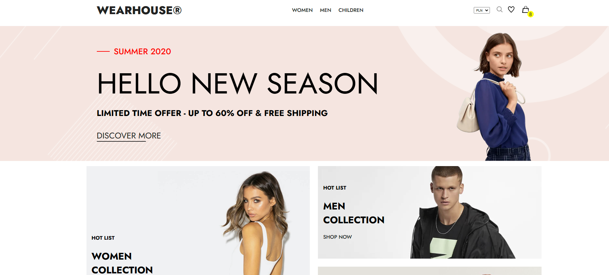

# E-Commerce App 🛒🌍

<p>
   
</p>

## 📄 Description
E-Commerce App is my first e-commerce website, created as a practical exercise.  

The application allows users to:
- Browse a catalog of products 🛍️
- Add products to their favorites ❤️
- Navigate through paginated product lists 📃

The API was built entirely by me for learning purposes.  
In the near future, I plan to extend the application with additional features, such as:
- Shopping cart functionality 🛍️
- Order management 🚚
- Dynamic language switching 🌐

---

## 🛠️ Technologies
<div style="display: flex; align-items: center; gap: 10px;">
  <div style="background-color: #f7df1e; color: #000; padding: 7px; border-radius: 5px; font-weight: bold; text-align: center; display: flex; justify-content: center; align-items: center;">
    HTML5
  </div>
  <div style="background-color: #264de4; color: #fff; padding: 7px; border-radius: 5px; font-weight: bold; text-align: center; display: flex; justify-content: center; align-items: center;">
    CSS3
  </div>
  <div style="background-color: #f0db4f; color: #000; padding: 7px; border-radius: 5px; font-weight: bold; text-align: center; display: flex; justify-content: center; align-items: center;">
    JavaScript
  </div>
  <div style="background-color: #61dafb; color: #000; padding: 7px; border-radius: 5px; font-weight: bold; text-align: center; display: flex; justify-content: center; align-items: center;">
    React
  </div>
  <div style="background-color: #764ABC; color: #fff; padding: 7px; border-radius: 5px; font-weight: bold; text-align: center; display: flex; justify-content: center; align-items: center;">
    React Router
  </div>
  <div style="background-color: #264de4; color: #fff; padding: 7px; border-radius: 5px; font-weight: bold; text-align: center; display: flex; justify-content: center; align-items: center;">
    Styled Components
  </div>
  <div style="background-color: #ff6f61; color: #fff; padding: 7px; border-radius: 5px; font-weight: bold; text-align: center; display: flex; justify-content: center; align-items: center;">
    JSON Server
  </div>
</div>


---

## ✨ Features
- Paginated product list 📃
- Add products to favorites ❤️
- Sort products by price ⬆️⬇️
- Responsive design for mobile devices 📱
- Custom-built JSON API for product data

---

## 🚀 Getting Started

### 1. Clone the repository
```bash
git clone https://github.com/YourUsername/ecommerce-app.git
```

### 2. Install dependencies
```bash
npm install
```

### 3. Run the project
```bash
npm start
```
- **JSON Server** will run on `http://localhost:5000`.  
- **React App** will automatically open in your browser at `http://localhost:3000`.

---

## 📦 Available Scripts
- **`npm start`**: Starts the development server and JSON API server.  
- **`npm run build`**: Builds the app for production in the `build` folder.

---

## 💡 Planned Features 
- Implement **order management** and **online payments** 💳  
- Create a **user purchase history** 📜  
- Add **user authentication** (login and registration) 🔑  
- Enable **multilingual support** 🌐  

---

## 🙌 Acknowledgments
This project is my first step into building e-commerce apps and improving my front-end development skills.  
Using React and Styled Components, I was able to create a modern interface that I plan to enhance with additional functionality in the future.

Feel free to reach out if you have any questions or suggestions about the project! 🚀
